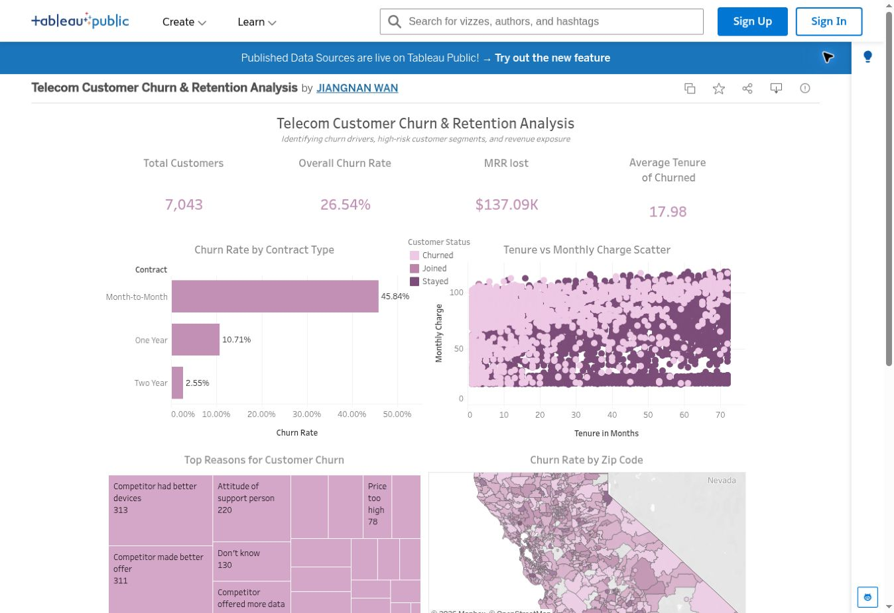
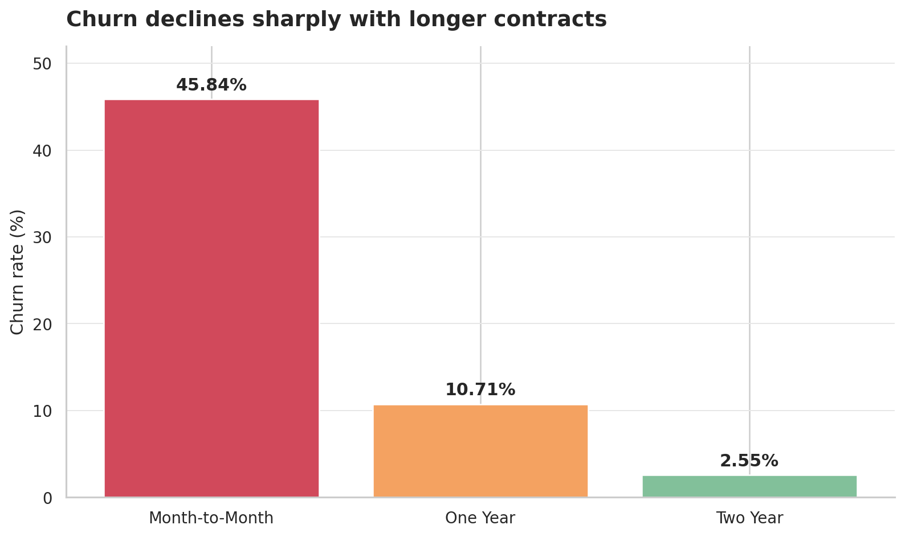
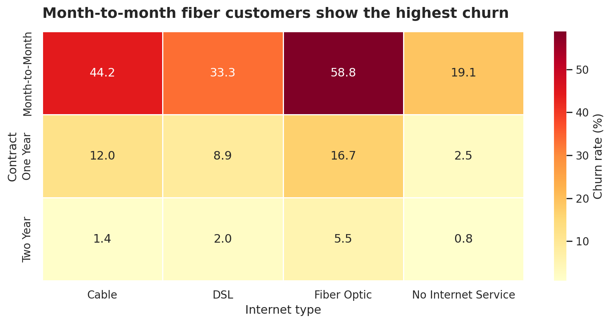
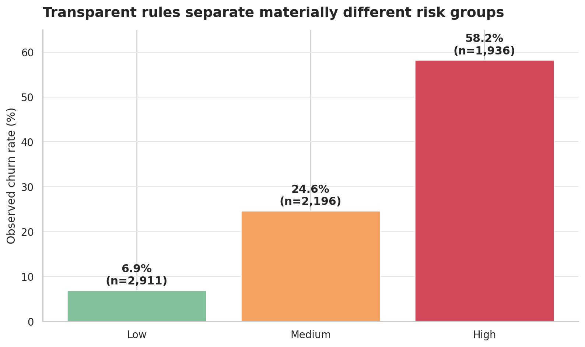

# Telecom Customer Churn & Retention Analysis

An end-to-end analytics project using SQL, Python/Pandas, and Tableau to identify customer churn patterns, quantify revenue exposure, prioritize high-risk customer groups, and translate findings into retention actions.

> **Dataset scope:** 7,043 customers from a fictional California telecommunications company. The data is published by Maven Analytics and sourced from IBM Cognos Analytics.

## Business questions

1. What is the overall churn level and associated monthly revenue exposure?
2. Which customer, contract, service, and billing characteristics are most associated with churn?
3. Which combinations define the highest-priority retention groups?
4. What retention actions should the business test first?

## Headline findings

| KPI | Result |
|---|---:|
| Total customers | 7,043 |
| Churned customers | 1,869 |
| Overall churn rate | 26.54% |
| Monthly revenue exposure (raw charge field) | $137,086.65 |
| Churned-customer historical revenue | $3,684,459.82 |
| Average churned tenure | 17.98 months |
| Month-to-month churn rate | 45.84% |
| One-year contract churn rate | 10.71% |
| Two-year contract churn rate | 2.55% |

The strongest descriptive pattern is contract duration: month-to-month customers churn at substantially higher rates than customers on one- or two-year contracts. High monthly charges, short tenure, fiber-optic service, and missing add-on support services also appear in higher-risk segments. These are associations rather than causal effects and should inform targeted experiments, not be treated as proof of why customers leave.

## Selected visuals

### Interactive Tableau dashboard

[Open the live dashboard on Tableau Public](https://public.tableau.com/app/profile/jiangnan.wan/viz/shared/ZWMXJ95HW)



The packaged workbook is available at [`tableau/telecom_churn_dashboard.twbx`](tableau/telecom_churn_dashboard.twbx). See [`tableau/README.md`](tableau/README.md) for its KPI definitions, views, calculations, and interaction design.

### Reproducible Python visuals







## Project structure

```text
telecom-customer-churn-analysis/
├── data/
│   ├── raw/                 # local source files (not committed)
│   ├── processed/           # generated clean tables (not committed)
│   └── README.md
├── docs/                    # metric definitions and business notes
├── notebooks/               # reproducible Python analysis
├── outputs/
│   ├── figures/
│   └── tables/
├── scripts/                 # preprocessing and validation
├── sql/                     # data quality, KPI, segmentation, risk SQL
├── tableau/                 # packaged Tableau workbook
├── requirements.txt
└── README.md
```

## Reproduce the analysis

1. Download the two CSV files described in [`data/README.md`](data/README.md).
2. Place them in `data/raw/` using the documented filenames.
3. Install dependencies:

   ```bash
   python -m pip install -r requirements.txt
   ```

4. Build the cleaned analysis table:

   ```bash
   python scripts/preprocess.py
   ```

5. Generate analysis tables and figures:

   ```bash
   python scripts/analyze.py
   ```

6. Run every SQL script locally:

   ```bash
   python scripts/run_sql.py
   ```

The SQL uses SQLite-compatible syntax and runs against a temporary table named `telecom_customers`, so no cloud account is required.

## Data-quality policy

The source contains 120 records with a negative `Monthly Charge`. Because the dataset does not document these values as discounts or credits, the preprocessing pipeline does not silently overwrite them. It keeps `monthly_charge_raw`, creates `monthly_charge_valid` with negative values set to missing, and flags affected rows using `invalid_monthly_charge_flag`.

For continuity with the original Tableau workbook, the headline monthly revenue exposure uses the raw source field. Charge-distribution and high-value-customer analyses use the validated field and explicitly report excluded records.

## Tools

- **SQL:** data-quality checks, KPI calculation, segmentation, and rule-based risk prioritization
- **Python/Pandas:** reproducible cleaning, feature engineering, EDA, and output generation
- **Tableau:** interactive KPI, contract, customer profile, churn reason, tenure-charge, and geographic analysis

## Source and license

- [Maven Analytics Telecom Customer Churn](https://mavenanalytics.io/data-playground/telecom-customer-churn)
- Original source: IBM Cognos Analytics
- License shown by Maven Analytics: Public Domain
